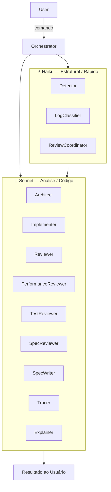
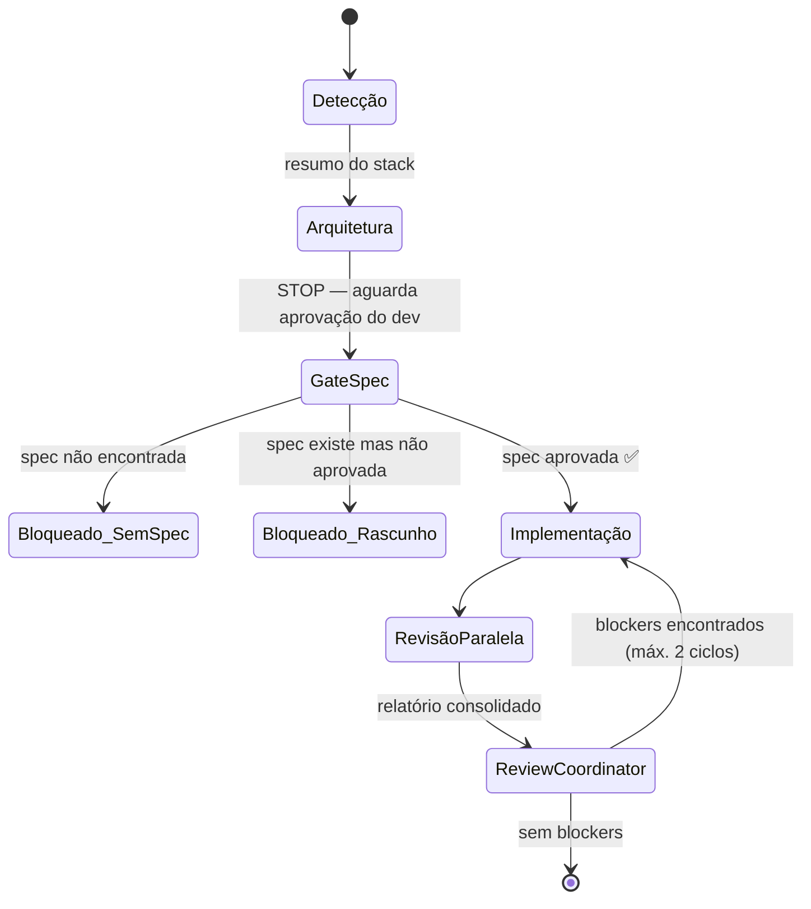

# engineer-workflow-claude

> Um workflow de desenvolvimento multi-agente e spec-first para o [Claude Code](https://claude.ai/code) — transformando a descrição de uma tarefa em código funcional e revisado através de um pipeline estruturado de agentes especializados.


---

## Visão Geral

Este projeto implementa um **pipeline de agentes orquestrado** sobre o Claude Code. Em vez de pedir a um único modelo que detecte, projete, implemente e revise tudo de uma vez, cada responsabilidade é decomposta em um subagente especializado — cada um com um papel focado, um modelo específico e uma entrada condensada.

O workflow impõe uma **disciplina spec-first**: nenhum código é escrito até que uma decisão arquitetural e uma especificação formal tenham sido revisadas e aprovadas pelo desenvolvedor. Isso cria um gate humano no loop que impede construir a coisa errada antes que as perguntas certas sejam respondidas.

Isto não é um framework e não substitui o desenvolvedor. É uma camada de processo estruturada — um conjunto de comandos e agentes que trazem ordem, rigor e consistência à forma como o Claude Code é usado em um projeto de software.

---

## Arquitetura

O sistema é composto por **12 subagentes especializados** orquestrados por **6 comandos**. Os agentes são atribuídos a modelos de acordo com a complexidade da tarefa:



**Disciplina de contexto:** os agentes nunca recebem o output bruto das etapas anteriores. Cada repasse é condensado em no máximo 20 linhas — reduzindo o custo de tokens e mantendo cada agente focado no seu contrato de entrada.

---

## Comandos

### `/coordinator` — Ciclo completo de desenvolvimento

O comando principal. Executa o pipeline completo da detecção ao código revisado.

**Entrada:** Descrição da tarefa em linguagem natural.

**Fluxo:**



| Etapa | Agente(s) | Gate |
|-------|-----------|------|
| 1. Detecção | Detector | — |
| 2. Arquitetura | Architect | **STOP** — dev aprova |
| 3. Verificação da spec | — | **BLOQUEIO** se não houver spec aprovada |
| 4. Implementação | Implementer | — |
| 5. Revisão | Reviewer + PerformanceReviewer + TestReviewer + SpecReviewer *(paralelo)* → ReviewCoordinator | — |

**Saída:** Código implementado + relatório de revisão unificado.

---

### `/refinement` — Spec e plano de implementação (sem código)

Executado antes do `/coordinator`. Gera uma especificação formal e um plano de implementação para aprovação do desenvolvedor.

**Entrada:** Descrição da tarefa.

**Fluxo:**
1. **Detecção** — Detector identifica o stack
2. **Perguntas abertas** — 5 perguntas estruturadas são levantadas (comportamento em falha, idempotência, transições de estado, contratos, decisões diferidas) → **STOP, aguarda respostas**
3. **Análise arquitetural** — Architect avalia opções em modo refinement
4. **Escrita da spec** — SpecWriter produz `/specs/[slug].md` com status `draft` → **STOP, aguarda aprovação**
5. **Síntese do plano** — Plano de implementação gerado (≤ 80 linhas)

**Saída:** `/specs/[slug].md` (draft → aprovada) + plano de implementação.

---

### `/review` — Revisão de código apenas

Revisa código existente ou um diff sem acionar a implementação.

**Entrada:** Lista de arquivos, diff ou `.claude/diff.md` detectado automaticamente.

**Fluxo:**
1. Detecção
2. Cinco revisores executam **em paralelo**: Reviewer, PerformanceReviewer, Architect (modo review), TestReviewer, SpecReviewer
3. ReviewCoordinator consolida em um único relatório deduplicado

**Saída:** Relatório de revisão unificado com findings categorizados por severidade.

---

### `/investigate` — Análise de log e stack trace

Reconstrói o caminho de execução que produziu uma entrada de log ou exceção.

**Entrada:** Log bruto ou stack trace.

**Fluxo:**
1. **LogClassifier** — extrai dados estruturados do log bruto
2. **Detector + Architect** *(paralelo)* — identifica o stack e candidatos de entry point
3. **Tracer** — reconstrói a call chain com níveis de confiança
4. **Explainer** — produz uma narrativa legível e um veredito diagnóstico

**Saída:** Narrativa explicativa + veredito (`PROBLEMA_REAL` / `COMPORTAMENTO_ESPERADO` / `COMPORTAMENTO_SUSPEITO` / `INCONCLUSIVO`).

---

### `/diff` — Gerar diff do git

**Entrada:** Branch atual.

**Fluxo:** Detecta a branch base (`origin/main`, `origin/master`, fallbacks locais) → executa `git diff <base>...HEAD` → salva em `.claude/diff.md`.

**Saída:** `.claude/diff.md` com diff completo e resumo das alterações.

---

### `/commit` — Mensagem de commit semântico

**Entrada:** Arquivos staged.

**Fluxo:** Analisa as mudanças staged → infere o tipo (`feat`, `fix`, `test`, `docs`, `chore`, `ci`, `build`, `style`) → gera mensagem em inglês imperativo e minúsculo → **STOP, aguarda aprovação do dev** → cria o commit.

**Saída:** Commit criado com mensagem semântica.

---

## Referência de Agentes

| Agente | Modelo | Responsabilidade | Entrada | Saída |
|--------|--------|------------------|---------|-------|
| **Detector** | Haiku | Identifica linguagem, versão do runtime, bibliotecas principais e convenções do projeto | Manifests (`package.json`, `go.mod`, etc.) | Resumo do stack (≤ 20 linhas) |
| **Architect** | Sonnet | Avalia tradeoffs arquiteturais em três modos: design, review, trace | Resumo do stack + descrição da tarefa | Opções com riscos e avaliação de complexidade |
| **SpecWriter** | Sonnet | Produz uma especificação formal em Gherkin com cenários, invariantes e contratos de output | Tarefa + stack + decisão arquitetural + respostas do dev | `/specs/[slug].md` (status: draft → aprovada) |
| **Implementer** | Sonnet | Escreve código de acordo com a spec aprovada e a decisão arquitetural | Stack + arquitetura + spec aprovada | Código + relatório de conformidade à spec |
| **Reviewer** | Sonnet | Valida DRY, KISS e Clean Code — não SOLID | Diff ou arquivos modificados | Violações categorizadas por severidade |
| **PerformanceReviewer** | Sonnet | Detecta problemas de performance (O(n²), queries N+1, memory leaks, etc.) | Diff/código + resumo do stack | Problemas com níveis de confiança |
| **TestReviewer** | Sonnet | Valida qualidade dos testes: cobertura, ghost tests, acoplamento comportamento vs. implementação | Testes + código modificado | Análise de cobertura e qualidade |
| **SpecReviewer** | Sonnet | Valida conformidade da implementação com a spec: cenários, invariantes, contratos | Spec aprovada + código implementado | Relatório de conformidade por elemento da spec |
| **ReviewCoordinator** | Haiku | Consolida 4–5 outputs de revisores em um único relatório deduplicado | Até 5 outputs de revisores | Relatório unificado com findings priorizados |
| **LogClassifier** | Haiku | Extrai estrutura objetiva de logs brutos (tipo de erro, tokens do stack, contexto da requisição) | Log bruto ou stack trace | Log estruturado (≤ 12 linhas) |
| **Tracer** | Sonnet | Reconstrói a sequência de execução de código que produziu um log | Log classificado + stack + candidatos de entry point | Call chain com nível de confiança |
| **Explainer** | Sonnet | Traduz um trace técnico em narrativa legível e veredito diagnóstico | Trace + log original + stack | Narrativa + veredito |

---

## Princípios de Design

**Spec-first.** O `/coordinator` é bloqueado se não houver spec aprovada. O gate de spec não é opcional — existe para evitar implementar a coisa errada.

**Humano no loop nos pontos de decisão.** Aprovações de arquitetura e spec exigem sign-off explícito do desenvolvedor antes de o pipeline continuar.

**Disciplina de custo.** Nenhum agente recebe output bruto de uma etapa anterior. Cada repasse é condensado (≤ 20 linhas). Agentes sem dependência entre si executam em paralelo.

**Crítico, não complacente.** Os agentes são instruídos a sinalizar problemas reais — inclusive em código produtivo e de alto valor. "Funciona" não é motivo para omitir um finding. A crítica é direta e honesta.

**Separação de responsabilidades.** Cada agente tem uma função. O Implementer não revisa. O Reviewer não implementa. O Architect não escreve código.

---

## Quick Start

```bash
# Dentro do diretório de qualquer projeto
curl -sO https://raw.githubusercontent.com/Leock9/flow-copilot/main/.claude/setup-claude.sh
bash setup-claude.sh
```

O script de setup copia `CLAUDE.md`, `agents/` e `commands/` para o diretório `.claude/` do projeto — o local que o Claude Code lê para instruções no nível do projeto.

### Requisitos

- CLI do [Claude Code](https://claude.ai/code) instalado e autenticado
- Permissões da tool `Task` habilitadas (necessário para invocar subagentes)

### Fluxo recomendado para uma nova feature

```
/refinement   →   revisar spec   →   /coordinator   →   /commit
```

1. `/refinement` — responda as perguntas abertas, aprove a spec
2. `/coordinator` — decisão arquitetural → implementação → ciclo de revisão
3. `/commit` — aprove a mensagem de commit semântico

---

## Fonte

Os prompts dos agentes e a lógica de orquestração dos comandos estão em [`Leock9/flow-copilot`](https://github.com/Leock9/flow-copilot) dentro de `.claude/`.
