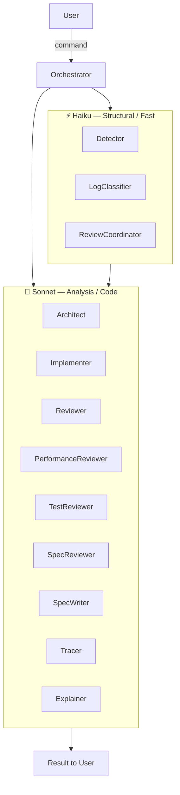
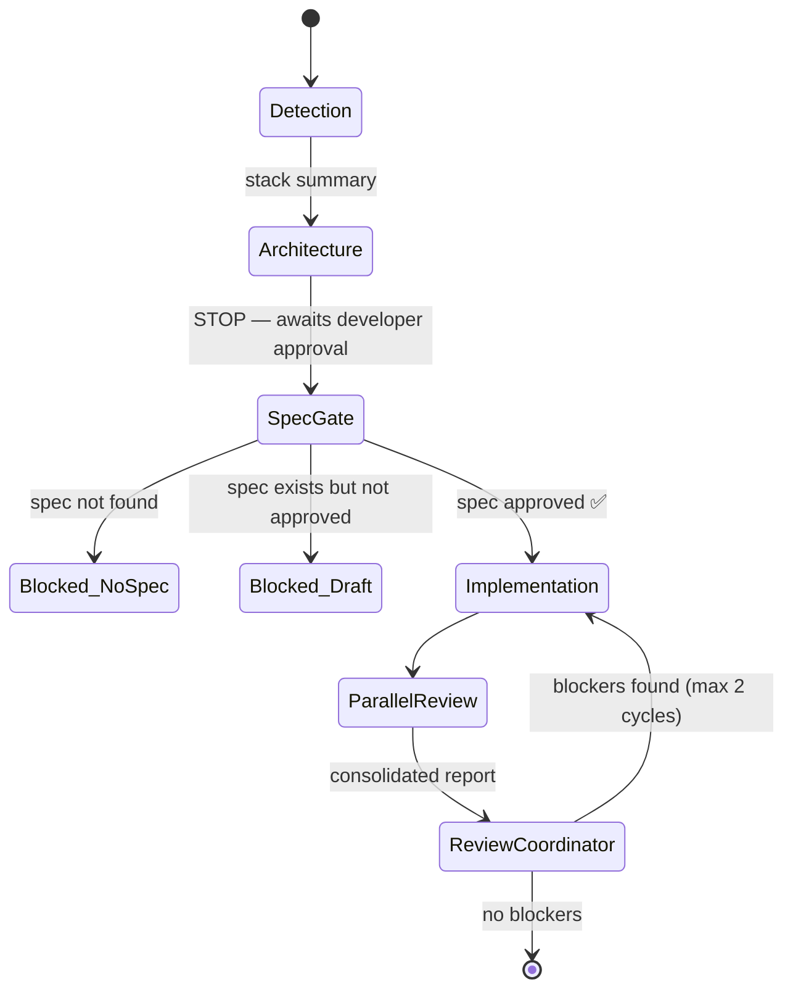

# engineer-workflow-claude

> A spec-first, multi-agent development workflow for [Claude Code](https://claude.ai/code) — turning a task description into reviewed, working code through a structured pipeline of specialized agents.


---

## Overview

This project implements an **orchestrated agent pipeline** on top of Claude Code. Instead of asking a single model to detect, design, implement, and review all at once, it decomposes each concern into a specialized subagent — each with a focused role, a specific model, and a condensed input.

The workflow enforces a **spec-first discipline**: no code is written until an architectural decision and a formal specification have been reviewed and approved by the developer. This creates a human-in-the-loop gate that prevents building the wrong thing before the right questions are answered.

This is not a framework and it does not replace the developer. It is a structured process layer — a set of commands and agents that bring order, rigor, and consistency to how Claude Code is used in a software project.

---

## Architecture Overview

The system consists of **12 specialized subagents** orchestrated by **6 commands**. Agents are assigned to models based on task complexity:



**Context discipline:** agents never receive raw output from previous steps. Every handoff is condensed to at most 20 lines — reducing token cost and keeping each agent focused on its specific input contract.

---

## Commands

### `/coordinator` — Full development cycle

The main command. Runs the complete pipeline from detection to reviewed code.

**Input:** Task description in natural language.

**Flow:**



| Step | Agent(s) | Gate |
|------|----------|------|
| 1. Detection | Detector | — |
| 2. Architecture | Architect | **STOP** — developer approves |
| 3. Spec check | — | **BLOCK** if no approved spec |
| 4. Implementation | Implementer | — |
| 5. Review | Reviewer + PerformanceReviewer + TestReviewer + SpecReviewer *(parallel)* → ReviewCoordinator | — |

**Output:** Implemented code + unified review report.

---

### `/refinement` — Spec and implementation plan (no code)

Runs before `/coordinator`. Generates a formal specification and an implementation plan for developer approval.

**Input:** Task description.

**Flow:**
1. **Detection** — Detector identifies stack
2. **Open questions** — 5 structured questions are raised (failure behavior, idempotence, state transitions, contracts, deferred decisions) → **STOP, awaits answers**
3. **Architecture analysis** — Architect evaluates options in refinement mode
4. **Spec writing** — SpecWriter produces `/specs/[slug].md` with status `draft` → **STOP, awaits approval**
5. **Plan synthesis** — Implementation plan generated (≤ 80 lines)

**Output:** `/specs/[slug].md` (draft → approved) + implementation plan.

---

### `/review` — Code review only

Reviews existing code or a diff without triggering implementation.

**Input:** File list, diff, or auto-detected `.claude/diff.md`.

**Flow:**
1. Detection
2. Five reviewers run **in parallel**: Reviewer, PerformanceReviewer, Architect (review mode), TestReviewer, SpecReviewer
3. ReviewCoordinator consolidates into a single deduplicated report

**Output:** Unified review report with findings categorized by severity.

---

### `/investigate` — Log and stack trace analysis

Reconstructs the execution path that produced a log entry or exception.

**Input:** Raw log or stack trace.

**Flow:**
1. **LogClassifier** — extracts structured data from raw log
2. **Detector + Architect** *(parallel)* — identifies stack and entry point candidates
3. **Tracer** — reconstructs the call chain with confidence levels
4. **Explainer** — produces a human-readable narrative and diagnostic verdict

**Output:** Narrative explanation + verdict (`REAL_PROBLEM` / `EXPECTED_BEHAVIOR` / `SUSPICIOUS_BEHAVIOR` / `INCONCLUSIVE`).

---

### `/diff` — Generate git diff

**Input:** Current git branch.

**Flow:** Detects base branch (`origin/main`, `origin/master`, local fallbacks) → runs `git diff <base>...HEAD` → saves to `.claude/diff.md`.

**Output:** `.claude/diff.md` with full diff and change summary.

---

### `/commit` — Semantic commit message

**Input:** Staged files.

**Flow:** Analyzes staged changes → infers type (`feat`, `fix`, `test`, `docs`, `chore`, `ci`, `build`, `style`) → generates message in imperative lowercase English → **STOP, awaits developer approval** → creates commit.

**Output:** Commit created with semantic message.

---

## Agent Reference

| Agent | Model | Responsibility | Input | Output |
|-------|-------|----------------|-------|--------|
| **Detector** | Haiku | Identifies language, runtime version, key libraries, and project conventions | Manifest files (`package.json`, `go.mod`, etc.) | Stack summary (≤ 20 lines) |
| **Architect** | Sonnet | Evaluates architectural trade-offs in three modes: design, review, trace | Stack summary + task description | Options with risks and complexity assessment |
| **SpecWriter** | Sonnet | Produces a formal specification in Gherkin with scenarios, invariants, and output contracts | Task + stack + architecture decision + developer answers | `/specs/[slug].md` (status: draft → approved) |
| **Implementer** | Sonnet | Writes code according to approved spec and architectural decision | Stack + architecture + approved spec | Code + spec conformance report |
| **Reviewer** | Sonnet | Validates DRY, KISS, and Clean Code — not SOLID | Diff or modified files | Violations categorized by severity |
| **PerformanceReviewer** | Sonnet | Detects performance issues (O(n²), N+1 queries, memory leaks, etc.) | Diff/code + stack summary | Issues with confidence levels |
| **TestReviewer** | Sonnet | Validates test quality: coverage, ghost tests, behavior vs. implementation coupling | Tests + modified code | Coverage and quality analysis |
| **SpecReviewer** | Sonnet | Validates implementation conformance to spec: scenarios, invariants, contracts | Approved spec + implemented code | Conformance report per spec element |
| **ReviewCoordinator** | Haiku | Consolidates 4–5 reviewer outputs into a single deduplicated report | Up to 5 reviewer outputs | Unified report with priority-ordered findings |
| **LogClassifier** | Haiku | Extracts objective structure from raw logs (error type, stack tokens, request context) | Raw log or stack trace | Structured log (≤ 12 lines) |
| **Tracer** | Sonnet | Reconstructs the code execution sequence that produced a given log | Classified log + stack + entry point candidates | Call chain with confidence level |
| **Explainer** | Sonnet | Translates a technical trace into a human narrative and diagnostic verdict | Trace + original log + stack | Narrative + verdict |

---

## Design Principles

**Spec-first.** `/coordinator` is blocked if no approved spec exists. The spec gate is not optional — it exists to prevent implementing the wrong thing.

**Human-in-the-loop at decision points.** Architecture and spec approvals require explicit developer sign-off before the pipeline continues.

**Cost discipline.** No agent receives raw output from a previous step. Every handoff is condensed (≤ 20 lines). Agents that don't depend on each other run in parallel.

**Critical, not compliant.** Agents are instructed to flag real problems — including in productive, high-value code. "It works" is not a reason to avoid a finding. Criticism is direct and honest.

**Separation of concerns.** Each agent has one job. The Implementer does not review. The Reviewer does not implement. The Architect does not write code.

---

## Quick Start

```bash
# Inside any project directory
curl -sO https://raw.githubusercontent.com/Leock9/flow-copilot/main/.claude/setup-claude.sh
bash setup-claude.sh
```

The setup script copies `CLAUDE.md`, `agents/`, and `commands/` into the project's `.claude/` directory — the location Claude Code reads for project-level instructions.

### Requirements

- [Claude Code](https://claude.ai/code) CLI installed and authenticated
- `Task` tool permissions enabled (required for subagent invocation)

### Recommended flow for a new feature

```
/refinement   →   review spec   →   /coordinator   →   /commit
```

1. `/refinement` — answer the open questions, approve the spec
2. `/coordinator` — architecture decision → implementation → review cycle
3. `/commit` — approve the semantic commit message

---

## Source

Agent prompts and command orchestration logic live in [`Leock9/flow-copilot`](https://github.com/Leock9/flow-copilot) under `.claude/`.
